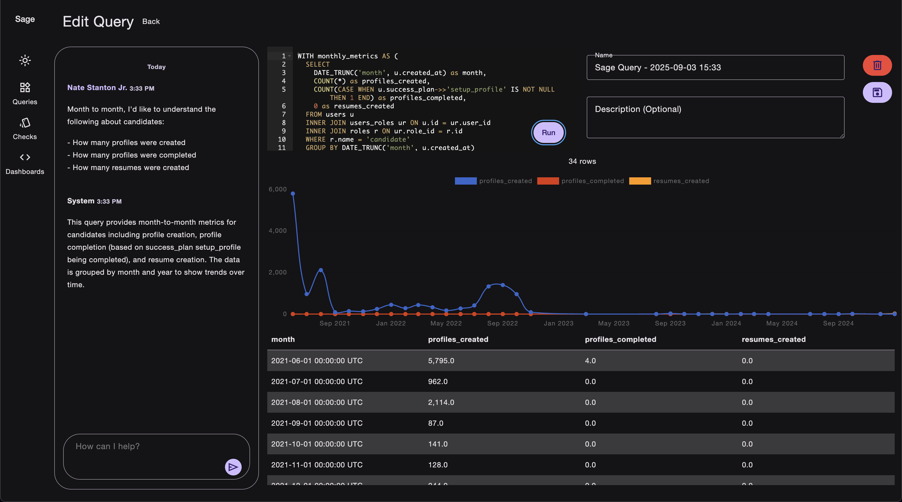

# Sage



**Natural language reporting to help your team build accurate reports, faster.**

Sage is a Rails engine that enhances [Blazer](https://github.com/ankane/blazer) by adding an LLM interface to make data exploration accessible via natural language.

## Installation

Add Sage to your application's Gemfile:

```ruby
gem "sage"
```

Run bundle install:
```bash
$ bundle install
```

## Getting Started

Run the install generator to set up Sage in your Rails application:

```bash
$ rails generate sage:install
```

This generator will:
- Install Blazer if not already present
- Mount Sage at `/sage` in your routes
- Create an initializer at `config/initializers/sage.rb`
- Set up database migrations for message storage
- Configure JavaScript and CSS dependencies

After installation, run the migrations:
```bash
$ rails db:migrate
```

Visit `/sage` in your application to start generating SQL queries from natural language!

## LLM Configuration

Sage supports both Anthropic Claude and OpenAI models for SQL generation. Configure your preferred AI service in `config/initializers/sage.rb`:

### Using Anthropic Claude (Recommended)

```ruby
Sage.configure do |config|
  config.ai_service = :anthropic
  
  # API Key Configuration (in order of precedence):
  # 1. Rails credentials
  # 2. Environment variables
  # 3. Direct configuration (not recommended for production)
  
  # Option 1: Rails credentials (recommended for production)
  # Run: rails credentials:edit
  # Add:
  #   anthropic:
  #     api_key: your_key_here
  
  # Option 2: Environment variables (.env file)
  # ANTHROPIC_API_KEY=your_key_here
  config.anthropic_api_key = Rails.application.credentials.dig(:anthropic, :api_key) || 
                              ENV["ANTHROPIC_API_KEY"]
  
  # Model selection (defaults to claude-3-opus-20240229)
  config.anthropic_model = "claude-3-opus-20240229"
  # Other available models:
  # - "claude-3-sonnet-20240229" (faster, lighter)
  # - "claude-3-haiku-20240307" (fastest, most economical)
end
```

### Using OpenAI

```ruby
Sage.configure do |config|
  config.ai_service = :openai
  
  # API Key Configuration
  config.openai_api_key = Rails.application.credentials.dig(:openai, :api_key) || 
                           ENV["OPENAI_API_KEY"]
  
  # Model selection
  config.openai_model = "gpt-4"  # or "gpt-3.5-turbo" for faster responses
end
```

## Blazer Integration

Sage is built on top of Blazer and honors all existing Blazer configurations. 

All Blazer features are fully supported:

- **Database Setup**: Configure your database connections through Blazer
- **Multiple Data Sources**: Switch between different databases seamlessly
- **Smart Variables**: Use dynamic variables in generated queries
- **Checks & Alerts**: Set up automated monitoring on your queries
- **Auditing**: Track query usage and performance
- **Security**: Leverage Blazer's authentication and authorization features

For detailed information on Blazer-specific features, refer to the [Blazer documentation](https://github.com/ankane/blazer).

## Database Context

Sage introspects your database schema to provide context for more accurate SQL generation. This feature works out of the box with Blazer's data sources.

### Multiple Data Sources

If you have multiple Blazer data sources configured, Sage will use the appropriate schema for each:

```ruby
# config/blazer.yml
data_sources:
  main:
    url: <%= ENV["DATABASE_URL"] %>
  analytics:
    url: <%= ENV["ANALYTICS_DATABASE_URL"] %>
```

When querying from different data sources in Blazer, Sage automatically switches schema context.

## Model Scope Context

Sage leverages your Rails model scopes as documentation for query patterns, dramatically improving the accuracy of generated SQL queries, especially for complex multi-table reports.

### Example

Given these model scopes:

```ruby
# app/models/user.rb
class User < ApplicationRecord
  scope :active, -> { where(status: 'active') }
  scope :recent, -> { where('created_at > ?', 30.days.ago) }
  scope :with_orders, -> { joins(:orders).distinct }
  scope :high_value, -> { 
    joins(:orders)
      .group('users.id')
      .having('SUM(orders.total) > ?', 1000) 
  }
end

# app/models/order.rb
class Order < ApplicationRecord
  scope :completed, -> { where(status: 'completed') }
  scope :recent, -> { where('created_at > ?', 7.days.ago) }
  scope :high_value, -> { where('total > ?', 500) }
end
```

When prompted: *"Show me high-value customers from the last month"*

Sage understands:
- "high-value customers" → Use the `high_value` scope pattern from User model
- "last month" → Similar to the `recent` scope pattern, adjust the time range
- Combines these patterns to generate accurate SQL with proper JOINs and aggregations

### Benefits

1. **Business Logic Awareness**: Scopes encode your business rules (what makes a customer "active" or "high-value")
2. **Correct JOIN Patterns**: Scopes show the proper way to join tables in your application
3. **Aggregation Patterns**: Complex scopes with GROUP BY and HAVING clauses guide report generation
4. **Consistency**: Generated queries follow the same patterns as your application code

### Writing Scope-Friendly Code

To maximize Sage's effectiveness:

```ruby
# Good: Clear, semantic scopes that document business logic
scope :premium_customers, -> { 
  joins(:subscriptions)
    .where(subscriptions: { tier: 'premium', status: 'active' })
}

scope :churned_recently, -> { 
  where(churned_at: 90.days.ago..30.days.ago)
}

# These scopes become documentation for Sage to understand:
# - What makes a customer "premium"
# - How to identify recently churned customers
# - The proper way to join subscriptions table
```

Your scopes now serve dual purpose:
1. Reusable query logic in your Rails application
2. Documentation for AI-powered SQL generation

## Development

After checking out the repo:

```bash
$ bundle install
$ cd test/dummy
$ rails db:create
$ rails db:migrate
$ rails server
```

Visit http://localhost:3000/sage to see the engine in action.

## Testing

Run the test suite:

```bash
$ rails test
```

## Troubleshooting

### API Key Issues
- Verify your API key is correctly set in credentials or environment variables
- Check Rails logs for authentication errors
- Ensure your API key has appropriate permissions

### Query Generation Issues
- Verify database schema is being loaded (check logs for schema context)
- Ensure model files are in standard Rails locations (`app/models/`)
- Check that Blazer is properly configured and can execute queries

### Performance
- Use lighter models (Claude Haiku, GPT-3.5) for faster response times
- Consider caching frequently used queries
- Scope context is cached per request to minimize processing

## Contributing

Bug reports and pull requests are welcome on GitHub. This project is intended to be a safe, welcoming space for collaboration.

## License

The gem is available as open source under the terms of the [MIT License](https://opensource.org/licenses/MIT).
